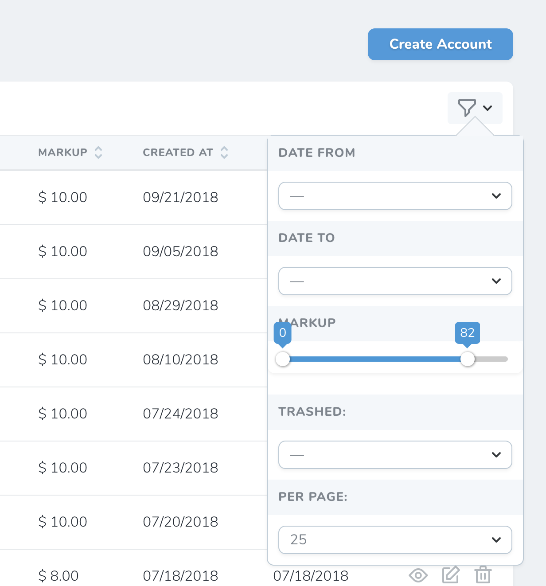

## Introduction

### Nova Slider

A custom vue component that fully supports filtering over a range of values



## Installation

You can install the package into a Laravel application that uses [Nova](https://nova.laravel.com) via composer:

```bash
composer require davidngugi/nova-slider
```

## Usage

Just use the `RP\Filters\NovaSlider` field in your Nova filter:

``` php

<?php
namespace App\Nova\Filters\Account;

use Illuminate\Http\Request;
use Laravel\Nova\Filters\Filter;

use RP\Filters\NovaSlider;

class Markup extends NovaSlider
{
    /**
     * Apply the filter to the given query.
     *
     * @param  \Illuminate\Http\Request  $request
     * @param  \Illuminate\Database\Eloquent\Builder  $query
     * @param  mixed  $value
     * @return \Illuminate\Database\Eloquent\Builder
     */
    public function apply(Request $request, $query, $value)
    {
        return $query->whereBetween('markup', $value);
    }

    /**
     * Get the filter's available options.
     *
     * @param  \Illuminate\Http\Request  $request
     * @return array
     */
    public function options(Request $request)
    {
        // custom configuration here
        return [
            'width'         => "100%", // default "100%"
            'height'        => "8", // default "8"
            'minimum'       => 0, // default 0
            'maximum'       => 100 // default 100
        ];
    }
}
```

# Contributions

All contributions (big or small) are highly welcomed. Send a PR

# Authors

* David Ngugi <david@davidngugi.com>

# Support

If you would love to support the continuous development and maintenance of this package, please consider buying me a coffee.

<a href = "https://www.buymeacoffee.com/DavidNgugi" title = "Buy Me a Coffee" target="_blank"></a>

# License

This package is open-sourced software licensed under the [MIT Licence](https://github.com/DavidNgugi/nova-slider/blob/master/LICENSE)